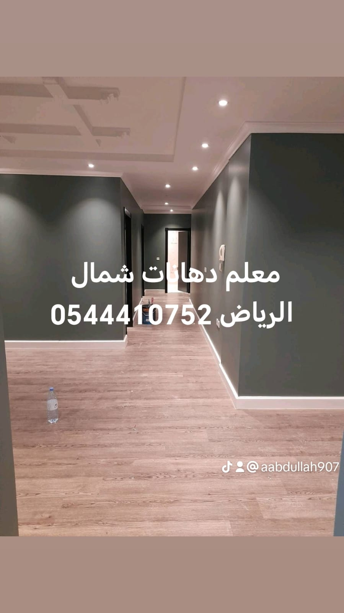
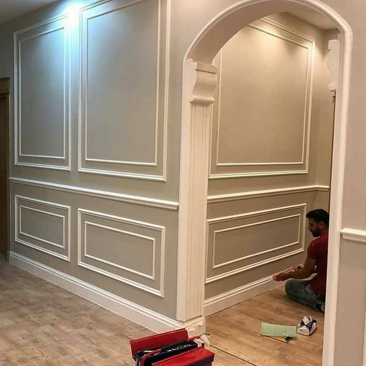
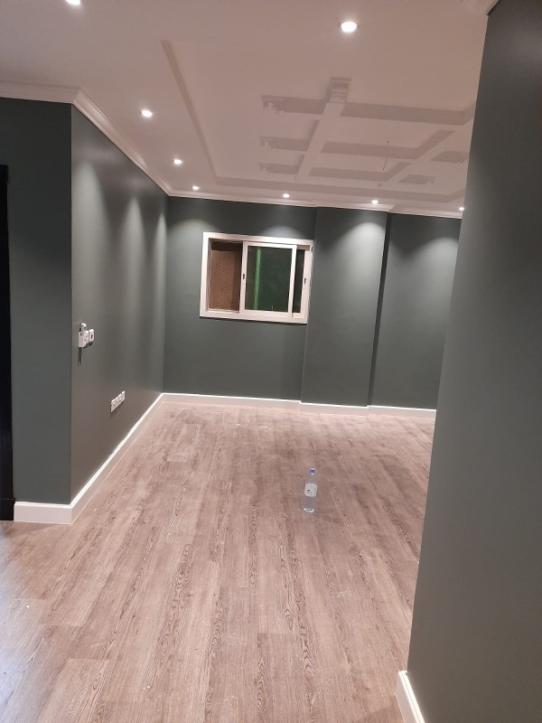
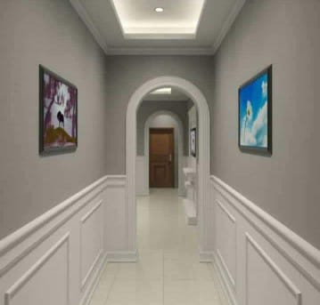
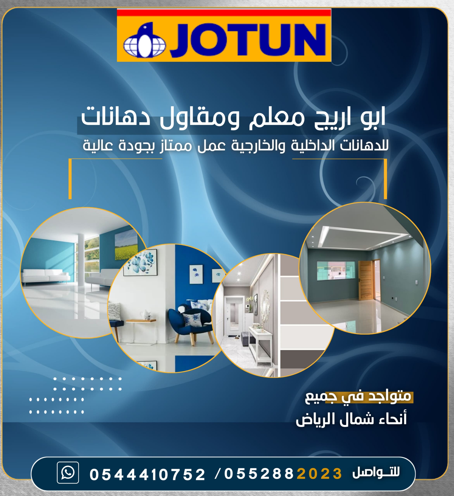

<!doctype html>
<html lang="ar" dir="rtl">
<head>
  <meta charset="utf-8" />
  <meta name="viewport" content="width=device-width,initial-scale=1" />
  <title>أبو أريج للدهانات</title>
  
</head>
<body>
  <!-- رأس الموقع -->
  <header>
    <h1>أبو أريج للدهانات</h1>
    
خبرة في جميع أعمال الدهانات والديكورات الداخلية والخارجية

  </header>

  <!-- قائمة التنقل -->
  <nav>
    <ul>
      <li><a href="#about">من نحن</a></li>
      <li><a href="#services">الخدمات</a></li>
      <li><a href="#gallery">واجهات الأعمال</a></li>
      <li><a href="#contact">تواصل معنا</a></li>
    </ul>
  </nav>

  <!-- قسم التعريف -->
<section id="about" class="about">
  <h2>من نحن</h2>
  

    أنا <strong>أبو أريج</strong>، معلم دهانات بخبرة واسعة في تنفيذ جميع أنواع الدهانات الداخلية والخارجية. 
    أعمل باحترافية عالية مع الحرص على أدق التفاصيل، باستخدام أجود المواد وأحدث الأساليب لضمان جودة تدوم لسنوات طويلة.
  

  

    أقدم حلول متكاملة تناسب ذوق العميل واحتياجاته، بداية من اختيار الألوان المناسبة وحتى التنفيذ بدقة عالية، 
    مع التزام تام بالمواعيد وأسعار تنافسية. رؤيتي هي أن أجعل كل مشروع تحفة فنية تعكس جمال المكان وتبرز ذوق العميل بأفضل صورة.
  

  <h3>لماذا تختارنا؟</h3>
  <ul style="list-style:none; padding:0; text-align:right; font-size:18px; line-height:1.8;">
    <li>🎨 تشكيلة واسعة من الألوان والديكورات</li>
    <li>🏠 خبرة في الفلل، الشقق، والمباني التجارية</li>
    <li>⏱ التزام كامل في المواعيد</li>
    <li>✅ جودة مضمونة باستخدام مواد أصلية</li>
    <li>🤝 رضا العميل هو أولويتنا</li>
  </ul>
</section>

  <!-- الخدمات -->
  <section id="services" class="services">
    <h2>الخدمات</h2>
    <ul>
      <li>دهانات واجهات خارجية مقاومة للعوامل الجوية</li>
      <li>دهانات داخلية بجميع الألوان والديكورات</li>
      <li>تنفيذ ديكورات زخرفية حديثة</li>
      <li>إصلاح وتجديد الواجهات</li>
      <li>استشارات احترافية في اختيار الألوان</li>
    </ul>
  </section>

  <!-- معرض الصور -->
  <section id="gallery">
    <h2>واجهات الأعمال</h2>
    

      
      
      
      

    

  </section>

  <!-- التواصل -->
  <section id="contact" class="contact">
    <h2>تواصل معنا</h2>
    
📞 الجوال: <strong>0544410752</strong>

    

      💬 واتساب: 
      <a class="btn" href="https://wa.me/966544410752" target="_blank">تواصل عبر واتساب</a>
    

  </section>

  <!-- الفوتر -->
  <footer>
    
© 2025 جميع الحقوق محفوظة — أبو أريج للدهانات

  </footer>
</body>
</html>